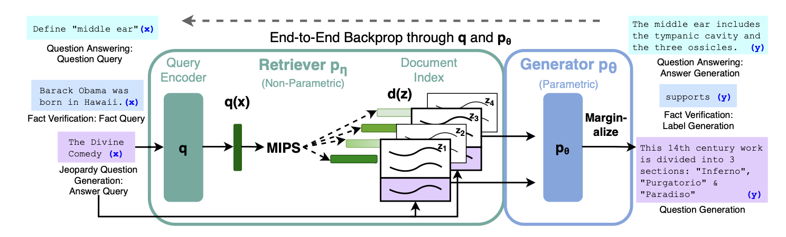

# Retrieval-Augmented Generation for Knowledge-Intensive NLP Tasks

- Paper: Retrieval-Augmented Generation for Knowledge-Intensive NLP Tasks
- Authors: Patrick Lewis, Ethan Perez, Aleksandra Piktus, Fabio Petroni, Vladimir Karpukhin, Naman Goyal, Heinrich Küttler, Mike Lewis, Wen-tau Yih, Tim Rocktäschel, Sebastian Riedel, Douwe Kiela
- ArXiv: https://arxiv.org/abs/2005.11401
- Presenter: Ash Ren

---

## Background
- Large pre-trained language models (LLMs) encode vast amounts of factual knowledge within their parameters.  
- **The challenge:** While they excel at many NLP tasks, LLMs have inherent limitations:  
  - Knowledge is static and difficult to update or correct  
  - Cannot reliably cite sources or provide provenance  
  - Susceptible to generating hallucinations  
- **The solution:** Augment LLMs with non-parametric memory by retrieving relevant documents, combining the model’s parametric knowledge with up-to-date external information.

### Previous Work
- REALM and ORQA: Encoder-based models for open-domain extractive QA.  

## Overview
### **RAG: Retrieval Augmented Generation**
- **RAG extends this hybrid parametric + non-parametric memory setup to sequence2seq encoder-decoder models.**
- RAG models take an input sequence, use it to retrieve text documents, and then uses the input and retrieved text documents as context to generate an output sequence.

### Main Components

- **Retriever:** $p_{\eta}(z \mid x)$  
  - Returns top-K text passages $z$ given the input query $x$  
  - Based on Dense Passage Retrieval (DPR)
  - Uses a bi-encoder setup:  
    - $q(x)$: Query representation encoded by a BERT-based query encoder  
    - $d(z)$: Document representation encoded by a BERT-based document encoder
      - Builds the document index, which stores dense vector embeddings of all passages
  - Documents are ranked using Maximum Inner Product Search (MIPS) to find the most relevant passages.
  - In the paper, the authors use a pre-trained neural retriever to access a dense vector index of Wikipedia 

- **Generator:** $p_{\theta}(y_i \mid x, z, y_{1:i-1})$  
  - Generates each next token $y_i$ based on:  
    - The input query $x$  
    - The retrieved document $z$ (concatenated with the query as context)  
    - All previously generated tokens $y_{1:i-1}$  
  - Implemented using **BART-large**, a sequence-to-sequence (seq2seq) transformer that encodes the combined input `[x ; z]` and decodes the output sequence.

---

## RAG Diagram

---

## RAG Variants
### 1. RAG-Sequence
- The model retrieves a set of relevant documents and uses that set to generate the entire output sequence through marginalization at the sequence level.

**How it works:**

1. The model retrieves the top-K documents relevant to the input query.  
2. Each retrieved document is treated as a latent variable and is used to generate an entire output sequence.  
3. For each document, the model computes the probability of generating every token in the sequence conditioned on the input query, the same retrieved document, and all previously generated tokens.  
4. The probability of the complete sequence for a given document is obtained by multiplying the probabilities of all generated tokens: $p_\theta(y|x, z) = \prod_{i=1}^N p_\theta(y_i|x, z, y_{1:i-1})$  
5. Finally, the model marginalizes over all retrieved documents by weighting each document’s sequence-level probability by its retrieval probability, $p_\eta(z|x)$, and summing across all K documents to obtain the final probability of the output sequence.

**Mathematically:**

$$
p_{\text{RAG-Sequence}}(y|x) = \sum_{z \in \text{top-k}(p(\cdot|x), Z)} p_\eta(z|x) \prod_{i=1}^N p_\theta(y_i|x, z, y_{1:i-1})
$$

**Key insight:** One document conditions the entire generation; marginalization happens at the sequence level.

**Use case:** Works well when most of the required information is contained in one or a few documents.  
**Limitation:** Less effective when information is distributed across multiple sources.   

---

### 2. RAG-Token
- The model allows **different retrieved documents to influence each token** in the generated output.  
- Instead of treating one document as the latent variable for the whole sequence, each token can draw from a different document.

**How it works:**
1. The model retrieves the top-K relevant documents for the query.  
2. The model generates the output token by token. At each token position $y_i$, the model computes the probability of that token for each document $p(y_i | x, z, y_{1:i-1})$, which is conditioned on the input query, the retrieved document, and the previously generated tokens.  
3. For the current token $y_i$, the model marginalizes over all retrieved documents by weighting each document’s token probability $p(y_i | x, z, y_{1:i-1})$ by its retrieval probability $p_\eta(z|x)$ and summing these contributions to obtain the final probability distribution for that token.  
4. The process repeats for the next token until the sequence is complete.  
5. The probability of the complete output sequence is obtained by multiplying the marginalized token probabilities across all token positions.

**Mathematically:**

$$
p_{\text{RAG-Token}}(y|x) = \prod_{i=1}^N \sum_{z \in \text{top-k}(p(\cdot|x), Z)} p_\eta(z|x) \; p_\theta(y_i|x, z, y_{1:i-1})
$$

**Key insight:** Each token has its own latent document variable; marginalization happens at the token level.

**Use case:** Ideal when information is scattered across multiple passages and needs to be integrated throughout the answer.  
**Limitation:** Computationally expensive, since it performs K forward passes per token (K × N computations for a sequence of length N).  

---

## Training

- **Joint Training:** The retriever and generator are trained together end-to-end without direct supervision on which documents to retrieve.
- **Objective:** Minimize the negative marginal log-likelihood of target outputs: $-\log p(y_j|x_j)$ using stochastic gradient descent with Adam optimizer.
- **Parameter Updates:**
  - **Document Encoder (BERT_d):** Kept frozen during training to avoid the computational cost of periodically reindexing all documents.
  - **Query Encoder (BERT_q) and Generator (BART):** Both are fine-tuned on the training corpus.
- **Key Insight:** Unlike REALM, which updates the document encoder during pre-training, RAG achieves strong performance without updating the document index, making training more efficient.

---

## Decoding

### RAG-Token Decoding
- **Approach:** Uses standard autoregressive beam search with a modified transition probability that marginalizes over retrieved documents at each token position.
- **Transition Probability:** 
  $$p'_\theta(y_i|x,y_{1:i-1}) = \sum_{z \in \text{top-k}(p(\cdot|x))} p_\eta(z|x) \; p_\theta(y_i|x,z,y_{1:i-1})$$
- **Implementation:** Plug this marginalized probability into a standard beam decoder to generate the output sequence token by token.

### RAG-Sequence Decoding
- **Challenge:** The likelihood $p(y|x)$ does not decompose into per-token probabilities, so standard beam search cannot be directly applied.
- **Solution:** Run separate beam searches for each of the K retrieved documents, scoring hypotheses with $p_\theta(y_i|x,z,y_{1:i-1})$.
- **Two Decoding Strategies:**
  - **Thorough Decoding:** 
    - Collect all hypotheses $Y$ from all document beams.
    - For hypotheses that didn't appear in all beams, run additional forward passes.
    - Compute final probability by weighting each document's generation probability with $p_\eta(z|x)$ and summing across all documents.
    - More accurate but computationally expensive for longer sequences.
  - **Fast Decoding:**
    - Approximates $p_\theta(y|x,z_i) \approx 0$ for hypotheses not generated during beam search from document $z_i$.
    - Avoids additional forward passes after generating the candidate set $Y$.
    - More efficient but slightly less accurate.

---

## RAG Algorithm Pseudocode

### Algorithm 1: Retriever
**Dense Passage Retriever (DPR) component**

**Input:** $x \in V^{\*}$, query sequence  
**Output:** $\tilde{z} \in (V^{\*})^K$, top-K retrieved documents  
**Output:** $p_\eta \in \mathbb{R}^K$, retrieval probabilities  
**Parameters:** $\eta$ consisting of $\text{BERT}_q$ parameters for query encoder and $\text{BERT}_d$ parameters for document encoder (frozen)  
**Hyperparameters:** $K \in \mathbb{N}$, number of documents to retrieve  
**External:** $D$, document index with precomputed embeddings

1. $q \leftarrow \text{BERT}_q(x)$
2. **for** $i \in [|D|]$: $s[i] \leftarrow d[i]^T q$
3. $\tilde{z}, \text{indices} \leftarrow \text{top-K}(s, D)$
4. $p_\eta \leftarrow \text{softmax}(s[\text{indices}])$
5. **return** $\tilde{z}, p_\eta$

**Where:**
- $q$: query embedding
- $d[i]$: precomputed document embedding for document $i$
- $s[i]$: similarity score between query and document $i$

---

### Algorithm 2: Generator
**BART-based sequence generator**

**Input:** $x \in V^{\*}$, input sequence  
**Input:** $z \in V^{\*}$, retrieved document  
**Input:** $y_{1:i-1} \in V^{\*}$, previous tokens  
**Output:** $p_\theta \in \Delta(V)$, probability distribution over next token  
**Parameters:** $\theta$, BART generator parameters

1. $c \leftarrow \text{concatenate}(x, z)$
2. $p_\theta \leftarrow \text{BART}(c, y_{1:i-1} \mid \theta)$
3. **return** $p_\theta$

**Where:**
- $c$: concatenated context (input sequence and retrieved document)

---

### Algorithm 3: RAG-Sequence
**RAG-Sequence: same document for entire sequence**

**Input:** $x \in V^{\*}$, input sequence  
**Output:** $p \in \Delta(V^{\*})$, probability over output sequences

1. $\tilde{z}, p_\eta \leftarrow \text{Retriever}(x \mid \eta, D)$
2. **for** $k \in [K]$:
   1. $p_k \leftarrow 1$
   2. **for** $i \in [N]$:
      1. $p_{\theta,i} \leftarrow \text{Generator}(x, \tilde{z}[k], y_{1:i-1} \mid \theta)$
      2. $p_k \leftarrow p_k \cdot p_{\theta,i}[y_i]$
3. **return** $p = \sum_{k=1}^K p_\eta[k] \cdot p_k$

**Where:**
- $N$: length of output sequence $y$
- $p_k$: probability of generating sequence $y$ using document $k$
- $p_{\theta,i}$: probability distribution over tokens at position $i$

---

### Algorithm 4: RAG-Token
**RAG-Token: different document per token**

**Input:** $x \in V^{\*}$, input sequence  
**Output:** $p \in \Delta(V^{\*})$, probability over output sequences

1. $\tilde{z}, p_\eta \leftarrow \text{Retriever}(x \mid \eta, D)$
2. $p \leftarrow 1$
3. **for** $i \in [N]$:
   1. $p_i \leftarrow 0$
   2. **for** $k \in [K]$:
      1. $p_{\theta,i,k} \leftarrow \text{Generator}(x, \tilde{z}[k], y_{1:i-1} \mid \theta)$
      2. $p_i \leftarrow p_i + p_\eta[k] \cdot p_{\theta,i,k}[y_i]$
   3. $p \leftarrow p \cdot p_i$
4. **return** $p$

**Where:**
- $N$: length of output sequence $y$
- $p_i$: marginalized probability of token $y_i$ over all documents
- $p_{\theta,i,k}$: probability distribution over tokens at position $i$ using document $k$

---

Question 1: If you were tasked with building a RAG chatbot that is used for troubleshooting technical issues in a cloud infrastructure platform (like AWS or Azure) and you could choose the underlying architecture, would you use RAG-Sequence or RAG-Token?

Because each step of a troubleshooting answer might depend on different documentation sources — such as error codes, CLI commands, or configuration guides — RAG-Token’s token-level retrieval lets the model dynamically pull the most relevant technical details as it generates the response.

---

## Empirical Results

| **Task** | **Evaluation Metric(s)** | **Key Takeaway** |
|-----------|---------------------------|----------------------------------|
| **Open-domain Question Answering** | Exact Match (EM) | RAG outperforms extractive retrievers like DPR and REALM, and generative seq2seq baselines such as T5 (closed-book). |
| **Abstractive Question Answering (MSMARCO)** | BLEU, ROUGE | RAG surpasses the BART seq2seq baseline, generating more factual and less hallucinatory responses. |
| **Jeopardy Question Generation** | Q-BLEU, Human Evaluation | RAG produces more factual and specific questions than the BART baseline, showing stronger knowledge-grounded generation. |
| **Fact Verification (FEVER)** | Classification Accuracy | RAG reaches performance comparable to state-of-the-art models, without relying on complex pipelines or additional supervision. |

---

## Critical Analysis

### What the Paper Did Well

- **Comprehensive Evaluation:** The paper tested RAG across diverse tasks (open-domain QA, abstractive QA, question generation, fact verification), demonstrating broad applicability rather than optimizing for a single benchmark.  
- **Human Evaluation:** Conducted human assessments showing RAG was more factual than BART in 42.7% of cases vs. 7.1%, with concrete evidence of reduced hallucinations.  
- **Explored Retrieval Settings:** The paper experimented with different numbers of retrieved documents during training and testing, showing that performance is robust across configurations and can improve when more documents are retrieved at test time.

### Key Limitations

- **Retrieval Quality Dependency:** RAG’s performance depends heavily on the quality and relevance of retrieved documents. When retrieval returns low-quality or off-topic evidence, the model still conditions on it, degrading output quality. Without a fallback mechanism, it implicitly relies on pretrained knowledge, often yielding generic or inaccurate responses.

- **Limited Exploration of Components:** All experiments use a single knowledge source (Wikipedia, December 2018), which may not always be reliable or complete. The generator also is fixed to BART-large, with no exploration of other seq2seq models or scaling effects.  

- **Conflicting Information Handling:** The paper does not explore how RAG resolves contradictions when retrieved documents contain conflicting information, and there is no mechanism to flag contradictory evidence to users.  

--- 

 Question 2: If you've already uploaded relevant documents to your RAG system but performance is still poor, which component would you focus on improving — retrieval or generation — and why?

You should focus on retrieval. Even with prompt engineering or an improved generator model, if the retriever returns irrelevant or low-quality documents, the system lacks adequate context to generate accurate responses. The principle of "garbage in, garbage out" applies directly here.
Improving retrieval through better embeddings, chunking strategies, or reranking mechanisms directly enhances the quality of context provided to the generator. Once high-quality documents are retrieved, even a relatively simple generator with effective prompting can produce accurate answers. However, the reverse is not true. No amount of generation improvements can compensate for poor retrieval performance.

---

## Impact

- **Novel Hybrid Architecture:** First end-to-end system combining learned retrieval with seq2seq generation. Built on prior work in open-domain QA (ORQA, REALM) and neural generation (BART, T5) to create a unified parametric and non-parametric memory framework using encoder-decoder models.
- **Domain-Specific Adaptation:** By utilizing domain-specific documents, RAG can generate accurate answers for specialized areas without retraining.    
- **Reduced Hallucinations & Improved Interpretability:** Grounded generation in retrieved documents leads to more factual, specific outputs and provides visible sources.  
- **Foundation for Modern AI:** Set the standard for hybrid parametric/non-parametric models; inspired ChatGPT browsing, Perplexity AI, enterprise solutions, and advanced variants like multi-modal and agentic RAG.
- **Influence on Subsequent Research:** Building on RAG’s foundation, later models like Fusion-in-Decoder (FiD) improved document fusion, and Self-RAG added self-reflective retrieval mechanisms that evaluate and filter context for relevance and factuality.
  
--- 

### Variable Definitions
| Symbol | Meaning |
|:-------|:---------|
| $x$ | Input query or question |
| $z$ | Retrieved document or passage |
| $Z$ | Set of all documents in the index |
| $y$ | Target output sequence |
| $y_i$ | Token generated at step *i* |
| $y_{1:i-1}$ | Sequence of all tokens generated before step *i* |
| $N$ | Length of the output sequence (number of tokens) |
| $K$ | Number of documents retrieved (top-K) |
| $\eta$ | Retriever parameters |
| $\theta$ | Generator parameters |
| $p_\eta(z \mid x)$ | Retriever probability: likelihood of document $z$ being relevant to query $x$ |
| $p_\theta(y_i \mid x, z, y_{1:i-1})$ | Generator probability: likelihood of token $y_i$ given query $x$, document $z$, and previous tokens |
| $q(x)$ | Query representation (dense vector) encoded by BERT query encoder |
| $d(z)$ | Document representation (dense vector) encoded by BERT document encoder |
| $\text{top-k}(p(\cdot \mid x), Z)$ | Set of top-K documents with highest retrieval probability from document set $Z$ |

---

## Citation

Lewis, P., Perez, E., Piktus, A., Petroni, F., Karpukhin, V., Goyal, N., Küttler, H., Lewis, M., Yih, W., Rocktäschel, T., Riedel, S., & Kiela, D. (2021, April 12). Retrieval-augmented generation for knowledge-intensive NLP tasks. arXiv.org. https://arxiv.org/abs/2005.11401 

## Other Resources

- Code Demo: https://colab.research.google.com/drive/1J4vv3AuKSaLhY6fdgtIcbYEPmkJivJE-?usp=sharing
- Repository containing code notebooks of various RAG techniques and architectures: https://github.com/NirDiamant/RAG_Techniques/tree/main?tab=readme-ov-file
- Summary of the paper: https://www.geeksforgeeks.org/nlp/retrieval-augmented-generation-rag-for-knowledge-intensive-nlp-tasks/
- Repository containg a curated list of RAG resources, tools, and research: https://github.com/Danielskry/Awesome-RAG
- Explanation of RAG architecture and workflow: https://www.geeksforgeeks.org/nlp/rag-architecture/
- Glossary overview and practical definition of RAG: https://www.databricks.com/glossary/retrieval-augmented-generation-rag
- Self-RAG: https://arxiv.org/abs/2310.11511
- Fusion in Decoder: https://arxiv.org/pdf/2007.01282

